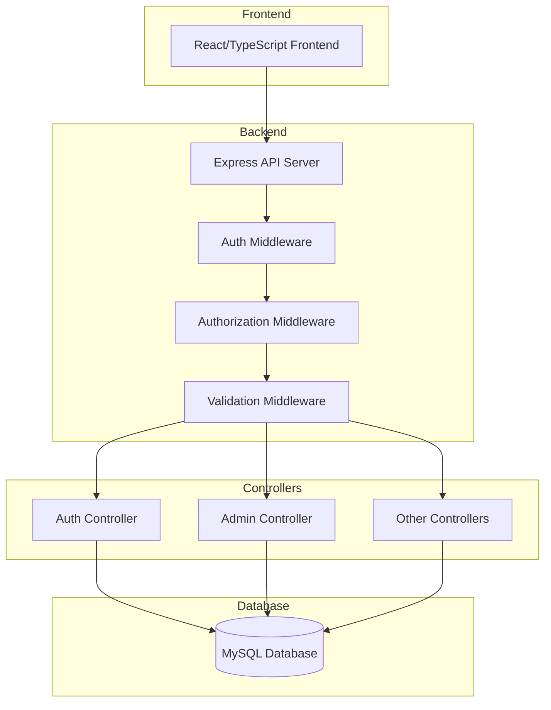
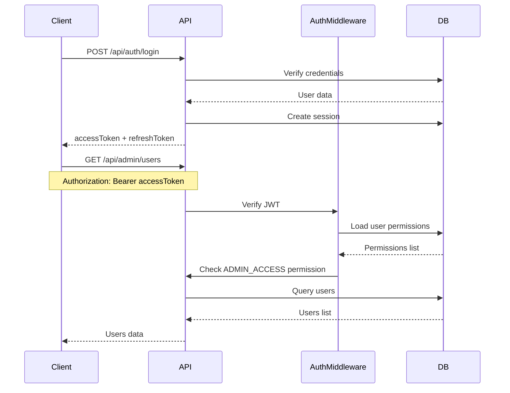
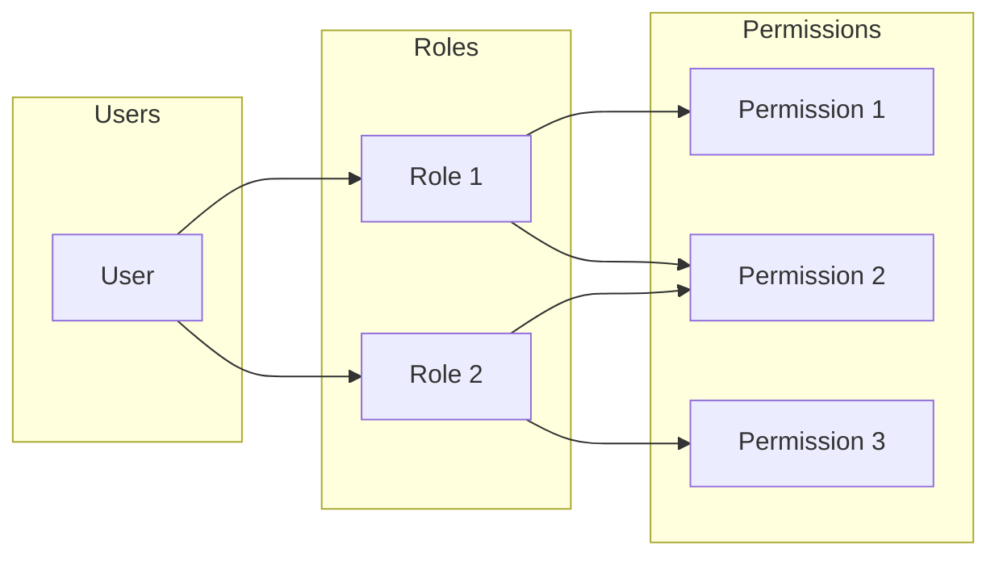

# Backend API Documentation - Administration Module

## Overview

This document provides a comprehensive description of the backend API for the **TaskFlow 2.0** application, focusing on the Administration module. The backend is built with **Node.js/Express** and uses **MySQL** as the database.

---

## Architecture Overview



---

## Base URL

All API endpoints are prefixed with `/api`:

```
http://localhost:5000/api
```

---

## Authentication System

### Authentication Flow



### Auth Endpoints

| Method | Endpoint | Description | Auth Required |
|--------|----------|-------------|---------------|
| POST | `/auth/login` | User login | No |
| POST | `/auth/logout` | User logout | Yes |
| POST | `/auth/refresh-token` | Refresh access token | No (requires refresh token) |
| GET | `/auth/profile` | Get current user profile | Yes |

### Login Request/Response

**Request:**
```json
{
  "username": "string",
  "password": "string"
}
```

**Response:**
```json
{
  "success": true,
  "message": "Connexion reussie",
  "data": {
    "token": "jwt_access_token",
    "accessToken": "jwt_access_token",
    "refreshToken": "refresh_token_hex",
    "tokenType": "Bearer",
    "user": {
      "id": 1,
      "username": "admin",
      "email": "admin@example.com",
      "nom_prenom": "Admin User",
      "poste": "Administrateur",
      "site": "Site A",
      "permissions": ["ADMIN_ACCESS", "ADMIN_USERS_READ", ...]
    },
    "sessionId": 123,
    "accessTokenExpiresIn": "15m",
    "refreshTokenExpiresAt": "2026-03-04T00:00:00.000Z",
    "expiresIn": "2026-03-04T00:00:00.000Z"
  }
}
```

> **Note - Doublon token/accessToken**: Les champs `token` et `accessToken` contiennent **exactement la même valeur**. Le champ `token` est conservé pour compatibilité avec d'anciennes versions du frontend. **Le frontend doit utiliser `accessToken`** comme référence principale. De même, `expiresIn` et `refreshTokenExpiresAt` sont identiques.

---

## Authorization System (RBAC)

### Permission Model

The system uses a **Role-Based Access Control (RBAC)** model with the following hierarchy:



### Permission Types

Users can have permissions through:
1. **Roles** - Permissions inherited from assigned roles
2. **Direct Permissions** - Permissions assigned directly to a user
   - `ACCORDER` - Grant permission
   - `REFUSER` - Deny permission (overrides role permissions)

### Admin Permissions Required

| Permission Code | Description | Category |
|-----------------|-------------|----------|
| `ADMIN_ACCESS` | Access admin panel | ADMIN |
| `ADMIN_DASHBOARD_READ` | View admin dashboard | ADMIN |
| `ADMIN_USERS_READ` | View users list | ADMIN |
| `ADMIN_USERS_WRITE` | Create/Update/Delete users | ADMIN |
| `ADMIN_ROLES_READ` | View roles list | ADMIN |
| `ADMIN_ROLES_WRITE` | Create/Update/Delete roles | ADMIN |
| `ADMIN_PERMISSIONS_READ` | View permissions list | ADMIN |
| `ADMIN_PERMISSIONS_WRITE` | Create/Delete permissions | ADMIN |
| `SESSION_MANAGE` | Manage user sessions | SESSIONS |
| `AUDIT_READ` | View audit logs | AUDIT |

---

## Admin API Endpoints

All admin endpoints require:
1. **Authentication** - Valid JWT token in `Authorization: Bearer <token>` header
2. **ADMIN_ACCESS permission** - Base permission for admin panel access
3. **Specific permissions** - Each endpoint requires additional permissions

### Dashboard

| Method | Endpoint | Permission | Description |
|--------|----------|------------|-------------|
| GET | `/admin/dashboard` | `ADMIN_DASHBOARD_READ` | Get admin dashboard statistics |

**Response:**
```json
{
  "success": true,
  "data": {
    "users": {
      "total_users": 50,
      "active_users": 45,
      "locked_users": 2
    },
    "roles": {
      "total_roles": 5,
      "active_roles": 5
    },
    "permissions": {
      "total_permissions": 42
    },
    "sessions": {
      "active_sessions": 12,
      "connected_users": 10
    },
    "audit": {
      "logs_last_24h": 150
    }
  }
}
```

---

### Users Management

#### List Users

| Method | Endpoint | Permission |
|--------|----------|------------|
| GET | `/admin/users` | `ADMIN_USERS_READ` |

**Query Parameters:**
| Parameter | Type | Description |
|-----------|------|-------------|
| `page` | number | Page number (default: 1) |
| `limit` | number | Items per page (default: 25, max: 100) |
| `search` | string | Search in username, email, name |
| `sortBy` | string | Sort field (ID, Username, Email, etc.) |
| `sortDir` | string | Sort direction (asc, desc) |
| `status` | string | Filter by status (active, inactive, locked) |
| `roleId` | number | Filter by role ID |
| `createdFrom` | string | Filter by creation date from (YYYY-MM-DD) |
| `createdTo` | string | Filter by creation date to (YYYY-MM-DD) |

**Response:**
```json
{
  "success": true,
  "count": 25,
  "data": [
    {
      "ID": 1,
      "ID_Personnel": 10,
      "Username": "admin",
      "Email": "admin@example.com",
      "Est_actif": 1,
      "Est_verifie": 1,
      "Est_verrouille": 0,
      "Tentatives_echec": 0,
      "Derniere_connexion": "2026-02-25T10:00:00.000Z",
      "Date_creation": "2025-01-01T00:00:00.000Z",
      "Date_modification": "2026-02-25T10:00:00.000Z",
      "Nom_prenom": "Admin User",
      "Roles_labels": "SUPER_ADMIN, FULL_ACCESS"
    }
  ],
  "pagination": {
    "page": 1,
    "limit": 25,
    "total": 50,
    "totalPages": 2
  },
  "filtersApplied": {
    "search": null,
    "status": null,
    "roleId": null,
    "createdFrom": null,
    "createdTo": null
  }
}
```

#### Get User Detail

| Method | Endpoint | Permission |
|--------|----------|------------|
| GET | `/admin/users/:id` | `ADMIN_USERS_READ` |

**Response:**
```json
{
  "success": true,
  "data": {
    "user": {
      "ID": 1,
      "Username": "admin",
      "Email": "admin@example.com",
      "Est_actif": 1,
      "Est_verifie": 1,
      "Est_verrouille": 0,
      ...
    },
    "roles": [
      {
        "ID": 1,
        "Code_role": "SUPER_ADMIN",
        "Nom_role": "Super Administrateur",
        "Niveau_priorite": 100
      }
    ],
    "permissions": [
      {
        "ID": 1,
        "Code_permission": "ADMIN_ACCESS",
        "Nom_permission": "Acces Administration",
        "Type": "ACCORDER",
        "Expiration": null
      }
    ],
    "sessions": [
      {
        "ID": 123,
        "ID_Utilisateur": 1,
        "IP_address": "192.168.1.1",
        "Date_connexion": "2026-02-25T10:00:00.000Z",
        "Date_expiration": "2026-03-04T10:00:00.000Z",
        "Est_active": 1
      }
    ]
  }
}
```

#### Create User

| Method | Endpoint | Permission |
|--------|----------|------------|
| POST | `/admin/users` | `ADMIN_USERS_WRITE` |

**Request Body:**
```json
{
  "Username": "newuser",
  "Email": "newuser@example.com",
  "Password": "SecurePass123!",
  "ID_Personnel": 10,
  "roles": [1, 2]
}
```

**Password Requirements:**
- Minimum 8 characters
- At least one uppercase letter
- At least one lowercase letter
- At least one digit
- At least one special character (@$!%*?&)

**Response:**
```json
{
  "success": true,
  "data": {
    "ID": 51,
    "Username": "newuser",
    "Email": "newuser@example.com"
  }
}
```

#### Update User

| Method | Endpoint | Permission |
|--------|----------|------------|
| PATCH | `/admin/users/:id` | `ADMIN_USERS_WRITE` |

**Request Body:**
```json
{
  "Username": "updateduser",
  "Email": "updated@example.com",
  "ID_Personnel": 15,
  "Est_verifie": true
}
```

#### Update User Status

| Method | Endpoint | Permission |
|--------|----------|------------|
| PATCH | `/admin/users/:id/status` | `ADMIN_USERS_WRITE` |

**Request Body:**
```json
{
  "Est_actif": false,
  "Est_verrouille": true
}
```

**Note:** When a user is deactivated or locked, all their active sessions are automatically terminated.

#### Reset User Password

| Method | Endpoint | Permission |
|--------|----------|------------|
| PATCH | `/admin/users/:id/password-reset` | `ADMIN_USERS_WRITE` |

**Request Body:**
```json
{
  "New_password": "NewSecurePass123!"
}
```

**Note:** This also terminates all active sessions for the user.

#### Replace User Roles

| Method | Endpoint | Permission |
|--------|----------|------------|
| PUT | `/admin/users/:id/roles` | `ADMIN_ROLES_WRITE` |

**Request Body:**
```json
{
  "roleIds": [1, 2, 3]
}
```

#### Replace User Permissions

| Method | Endpoint | Permission |
|--------|----------|------------|
| PUT | `/admin/users/:id/permissions` | `ADMIN_PERMISSIONS_WRITE` |

**Request Body:**
```json
{
  "permissions": [
    {
      "permissionId": 1,
      "type": "ACCORDER",
      "expiration": "2026-12-31"
    },
    {
      "permissionId": 2,
      "type": "REFUSER",
      "expiration": null
    }
  ]
}
```

#### Force Expire User Sessions

| Method | Endpoint | Permission |
|--------|----------|------------|
| PATCH | `/admin/users/:id/expire-sessions` | `SESSION_MANAGE` |

> **Note - Différence entre les deux mécanismes de révocation**:
> 
> | Endpoint | Portée | Effet en base |
> |----------|--------|---------------|
> | `PATCH /admin/sessions/:id/revoke` | Une seule session | `Est_active = 0` |
> | `PATCH /admin/users/:id/expire-sessions` | Toutes les sessions d'un utilisateur | `Est_active = 0` ET `Date_expiration = NOW()` |
>
> Le second endpoint est plus "agressif" : il force également la date d'expiration à NOW(), ce qui garantit que même si le refresh token était encore valide, il ne pourra plus être utilisé.

#### Delete User

| Method | Endpoint | Permission |
|--------|----------|------------|
| DELETE | `/admin/users/:id` | `ADMIN_USERS_WRITE` |

**Note:** Cannot delete your own account.

---

### Roles Management

#### List Roles

| Method | Endpoint | Permission |
|--------|----------|------------|
| GET | `/admin/roles` | `ADMIN_ROLES_READ` |

**Query Parameters:**
| Parameter | Type | Description |
|-----------|------|-------------|
| `page` | number | Page number |
| `limit` | number | Items per page |
| `search` | string | Search in code, name, description |
| `sortBy` | string | Sort field |
| `sortDir` | string | Sort direction |
| `active` | string | Filter active (0, 1) |
| `system` | string | Filter system roles (0, 1) |

**Response:**
```json
{
  "success": true,
  "count": 5,
  "data": [
    {
      "ID": 1,
      "Code_role": "SUPER_ADMIN",
      "Nom_role": "Super Administrateur",
      "Description": "Role avec tous les droits",
      "Niveau_priorite": 100,
      "Est_systeme": 1,
      "Est_actif": 1,
      "users_count": 2,
      "permissions_count": 42
    }
  ],
  "pagination": {...}
}
```

#### Get Role Permissions

| Method | Endpoint | Permission |
|--------|----------|------------|
| GET | `/admin/roles/:id/permissions` | `ADMIN_ROLES_READ` |

**Response:**
```json
{
  "success": true,
  "count": 42,
  "data": [
    {
      "ID": 1,
      "Code_permission": "ADMIN_ACCESS",
      "Nom_permission": "Acces Administration",
      "Categorie": "ADMIN"
    }
  ]
}
```

#### Create Role

| Method | Endpoint | Permission |
|--------|----------|------------|
| POST | `/admin/roles` | `ADMIN_ROLES_WRITE` |

**Request Body:**
```json
{
  "Code_role": "MANAGER",
  "Nom_role": "Manager",
  "Description": "Role manager",
  "Niveau_priorite": 50,
  "Est_systeme": 0,
  "Est_actif": 1
}
```

**Code_role Requirements:**
- 2-50 characters
- Uppercase letters, numbers, and underscores only
- Pattern: `^[A-Z0-9_]+$`

#### Update Role

| Method | Endpoint | Permission |
|--------|----------|------------|
| PATCH | `/admin/roles/:id` | `ADMIN_ROLES_WRITE` |

**Request Body:**
```json
{
  "Nom_role": "Updated Manager",
  "Description": "Updated description",
  "Niveau_priorite": 60,
  "Est_actif": 1
}
```

#### Replace Role Permissions

| Method | Endpoint | Permission |
|--------|----------|------------|
| PUT | `/admin/roles/:id/permissions` | `ADMIN_ROLES_WRITE` |

**Request Body:**
```json
{
  "permissionIds": [1, 2, 3, 4, 5]
}
```

#### Delete Role

| Method | Endpoint | Permission |
|--------|----------|------------|
| DELETE | `/admin/roles/:id` | `ADMIN_ROLES_WRITE` |

**Note:** System roles (`Est_systeme = 1`) cannot be deleted.

---

### Permissions Management

#### List Permissions

| Method | Endpoint | Permission |
|--------|----------|------------|
| GET | `/admin/permissions` | `ADMIN_PERMISSIONS_READ` |

**Query Parameters:**
| Parameter | Type | Description |
|-----------|------|-------------|
| `page` | number | Page number |
| `limit` | number | Items per page |
| `search` | string | Search in code, name, description, category |
| `sortBy` | string | Sort field |
| `sortDir` | string | Sort direction |
| `module` | string | Filter by category |

**Response:**
```json
{
  "success": true,
  "count": 42,
  "data": [
    {
      "ID": 1,
      "Code_permission": "ADMIN_ACCESS",
      "Nom_permission": "Acces Administration",
      "Description": "Acceder au panneau d administration",
      "Categorie": "ADMIN",
      "Date_creation": "2025-01-01T00:00:00.000Z",
      "roles_count": 3,
      "roles_labels": "SUPER_ADMIN, FULL_ACCESS, ADMIN",
      "used_by_system_role": 1
    }
  ],
  "pagination": {...}
}
```

#### Create Permission

| Method | Endpoint | Permission |
|--------|----------|------------|
| POST | `/admin/permissions` | `ADMIN_PERMISSIONS_WRITE` |

**Request Body:**
```json
{
  "Code_permission": "CUSTOM_PERMISSION",
  "Nom_permission": "Custom Permission",
  "Description": "Description of the permission",
  "Categorie": "CUSTOM"
}
```

#### Delete Permission

| Method | Endpoint | Permission |
|--------|----------|------------|
| DELETE | `/admin/permissions/:id` | `ADMIN_PERMISSIONS_WRITE` |

**Note:** Deleting a permission also removes it from all roles and users.

> **Note - Endpoint manquant GET /admin/permissions/:id**: Il n'existe pas d'endpoint pour récupérer le détail d'une permission individuelle. C'est **intentionnel** car les permissions sont des entités simples (code, nom, description, catégorie). Utilisez `GET /admin/permissions` avec filtre par ID ou code si nécessaire, ou récupérez les permissions via `GET /admin/roles/:id/permissions`.

---

### Sessions Management

#### List Sessions

| Method | Endpoint | Permission |
|--------|----------|------------|
| GET | `/admin/sessions` | `SESSION_MANAGE` |

**Query Parameters:**
| Parameter | Type | Description |
|-----------|------|-------------|
| `page` | number | Page number |
| `limit` | number | Items per page |
| `search` | string | Search in username, email, IP |
| `sortBy` | string | Sort field |
| `sortDir` | string | Sort direction |
| `userId` | number | Filter by user ID |
| `active` | string | Filter active sessions (0, 1) |
| `from` | string | Filter from date (YYYY-MM-DD) |
| `to` | string | Filter to date (YYYY-MM-DD) |

**Response:**
```json
{
  "success": true,
  "count": 15,
  "data": [
    {
      "ID": 123,
      "ID_Utilisateur": 1,
      "Username": "admin",
      "Email": "admin@example.com",
      "IP_address": "192.168.1.1",
      "User_agent": "Mozilla/5.0...",
      "Date_connexion": "2026-02-25T10:00:00.000Z",
      "Derniere_activite": "2026-02-25T15:00:00.000Z",
      "Date_expiration": "2026-03-04T10:00:00.000Z",
      "Est_active": 1
    }
  ],
  "pagination": {...}
}
```

#### Revoke Session

| Method | Endpoint | Permission |
|--------|----------|------------|
| PATCH | `/admin/sessions/:id/revoke` | `SESSION_MANAGE` |

---

### Audit Logs

#### List Audit Logs

| Method | Endpoint | Permission |
|--------|----------|------------|
| GET | `/admin/audit` | `AUDIT_READ` |

---

## FAQ - Questions Fréquentes

### Q1: Pourquoi `token` et `accessToken` ont-ils la même valeur ?

Les deux champs contiennent exactement la même valeur JWT. Le champ `token` est conservé pour **rétrocompatibilité** avec d'anciennes versions du frontend. Utilisez **`accessToken`** comme référence principale dans le nouveau code.

### Q2: Pourquoi stocker `Username` ET `ID_Utilisateur` dans `logs_audit` ?

Cette duplication est **intentionnelle** pour des raisons d'audit :
- `ID_Utilisateur` : Permet de faire le lien avec l'utilisateur actuel (peut être `NULL` si supprimé)
- `Username` : Snapshot du nom au moment de l'action, garantissant une trace même si l'utilisateur est supprimé ou renommé

Dans la réponse API :
- `Username` : Valeur stockée dans l'audit (historique)
- `Username_utilisateur` : Valeur actuelle via JOIN (peut différer ou être `NULL`)

### Q3: Différence entre les deux endpoints de révocation de session ?

| Endpoint | Portée | Effet en base |
|----------|--------|---------------|
| `PATCH /admin/sessions/:id/revoke` | Une seule session | `Est_active = 0` |
| `PATCH /admin/users/:id/expire-sessions` | Toutes les sessions d'un utilisateur | `Est_active = 0` ET `Date_expiration = NOW()` |

Le second est plus agressif : il force également la date d'expiration à NOW(), ce qui garantit que même si le refresh token était encore valide, il ne pourra plus être utilisé.

### Q4: Le rôle "ADMIN" existe-t-il ?

Non. Les rôles prédéfinis sont : `SUPER_ADMIN`, `FULL_ACCESS`, `LECTURE_SEULE`. Le rôle "ADMIN" dans les exemples est fictif. D'autres rôles peuvent être créés via l'API.

### Q5: Pourquoi pas de `GET /admin/permissions/:id` ?

C'est **intentionnel**. Les permissions sont des entités simples. Utilisez :
- `GET /admin/permissions` avec filtres
- `GET /admin/roles/:id/permissions` pour les permissions d'un rôle

### Q6: Comment fonctionne `Niveau_priorite` ?

Le champ est **purement informatif**. Il n'influence PAS la résolution des permissions. En cas de conflit entre permissions, le système utilise :
1. Permissions directes `ACCORDER` / `REFUSER`
2. Permissions héritées des rôles (toutes accumulées)

La priorité sert uniquement au tri et à l'affichage dans l'UI.

**Query Parameters:**
| Parameter | Type | Description |
|-----------|------|-------------|
| `page` | number | Page number |
| `limit` | number | Items per page |
| `search` | string | Search in action, table, username, IP |
| `sortBy` | string | Sort field |
| `sortDir` | string | Sort direction |
| `userId` | number | Filter by user ID |
| `action` | string | Filter by action type |
| `table` | string | Filter by table name |
| `from` | string | Filter from date (YYYY-MM-DD) |
| `to` | string | Filter to date (YYYY-MM-DD) |

**Response:**
```json
{
  "success": true,
  "count": 100,
  "data": [
    {
      "ID": 1001,
      "ID_Utilisateur": 1,
      "Username": "admin",
      "Username_utilisateur": "admin",
      "Action": "LOGIN_SUCCESS",
      "Table_concernee": "auth",
      "ID_Enregistrement": null,
      "Ancienne_valeur": null,
      "Nouvelle_valeur": null,
      "Date_action": "2026-02-25T10:00:00.000Z",
      "IP_address": "192.168.1.1",
      "User_agent": "Mozilla/5.0..."
    }
  ],
  "pagination": {...}
}
```

> **Note - Username vs Username_utilisateur**: 
> - `Username` : Valeur stockée dans `logs_audit` au moment de l'action (snapshot). Permet de conserver une trace même si l'utilisateur est supprimé ou renommé.
> - `Username_utilisateur` : Valeur actuelle dans la table `utilisateurs` (via JOIN). Peut être `null` si l'utilisateur a été supprimé.
>
> Cette duplication est **intentionnelle** pour des raisons d'audit et de traçabilité historique.

---

## Error Responses

All endpoints return consistent error responses:

### 400 Bad Request
```json
{
  "success": false,
  "error": "Validation error message"
}
```

### 401 Unauthorized
```json
{
  "success": false,
  "error": "Token invalide ou expire"
}
```

### 403 Forbidden
```json
{
  "success": false,
  "error": "Permission requise: ADMIN_USERS_READ"
}
```

### 404 Not Found
```json
{
  "success": false,
  "error": "Utilisateur non trouve"
}
```

### 409 Conflict
```json
{
  "success": false,
  "error": "Code_permission deja existant"
}
```

### 500 Internal Server Error
```json
{
  "success": false,
  "error": "Erreur interne du serveur"
}
```

---

## Database Schema (Relevant Tables)

### utilisateurs (Users)
| Column | Type | Description |
|--------|------|-------------|
| ID | INT | Primary key |
| ID_Personnel | INT | FK to personnel |
| Username | VARCHAR(50) | Unique username |
| Email | VARCHAR(100) | Unique email |
| Password_hash | VARCHAR(255) | Bcrypt hash |
| Est_actif | TINYINT | Active status (0/1) |
| Est_verifie | TINYINT | Verified status (0/1) |
| Est_verrouille | TINYINT | Locked status (0/1) |
| Tentatives_echec | INT | Failed login attempts |
| Derniere_connexion | DATETIME | Last login |
| Date_creation | DATETIME | Creation date |
| Date_modification | DATETIME | Last update |

### roles (Roles)
| Column | Type | Description |
|--------|------|-------------|
| ID | INT | Primary key |
| Code_role | VARCHAR(50) | Unique role code |
| Nom_role | VARCHAR(100) | Role name |
| Description | TEXT | Role description |
| Niveau_priorite | INT | Priority level (informatif) |
| Est_systeme | TINYINT | System role (0/1) |
| Est_actif | TINYINT | Active status (0/1) |

> **Note - Comportement de Niveau_priorite**: Le champ `Niveau_priorite` est **purement informatif**. Il n'est PAS utilisé par le système d'autorisation pour résoudre les conflits de permissions. En cas de conflit entre deux rôles (ex: un rôle accorde une permission, un autre la refuse), c'est le mécanisme de permissions directes qui tranche, pas la priorité des rôles. Ce champ sert uniquement à l'affichage et au tri dans l'interface d'administration.

### permissions (Permissions)
| Column | Type | Description |
|--------|------|-------------|
| ID | INT | Primary key |
| Code_permission | VARCHAR(100) | Unique permission code |
| Nom_permission | VARCHAR(255) | Permission name |
| Description | TEXT | Permission description |
| Categorie | VARCHAR(100) | Category/module |
| Date_creation | DATETIME | Creation date |

### utilisateurs_roles (User-Role Junction)
| Column | Type | Description |
|--------|------|-------------|
| ID_Utilisateur | INT | FK to utilisateurs |
| ID_Role | INT | FK to roles |
| Date_assignation | DATETIME | Assignment date |
| Assigne_par | INT | Assigned by user ID |

### utilisateurs_permissions (User-Permission Junction)
| Column | Type | Description |
|--------|------|-------------|
| ID_Utilisateur | INT | FK to utilisateurs |
| ID_Permission | INT | FK to permissions |
| Type | ENUM | ACCORDER or REFUSER |
| Date_assignation | DATETIME | Assignment date |
| Assigne_par | INT | Assigned by user ID |
| Expiration | DATE | Expiration date |

### roles_permissions (Role-Permission Junction)
| Column | Type | Description |
|--------|------|-------------|
| ID_Role | INT | FK to roles |
| ID_Permission | INT | FK to permissions |

### sessions (Sessions)
| Column | Type | Description |
|--------|------|-------------|
| ID | INT | Primary key |
| ID_Utilisateur | INT | FK to utilisateurs |
| Token_session | VARCHAR(255) | Hashed refresh token |
| IP_address | VARCHAR(45) | Client IP |
| User_agent | TEXT | Client user agent |
| Date_connexion | DATETIME | Login time |
| Derniere_activite | DATETIME | Last activity |
| Date_expiration | DATETIME | Expiration time |
| Est_active | TINYINT | Active status (0/1) |

### logs_audit (Audit Logs)
| Column | Type | Description |
|--------|------|-------------|
| ID | INT | Primary key |
| ID_Utilisateur | INT | FK to utilisateurs |
| Username | VARCHAR(50) | Username at action time |
| Action | VARCHAR(120) | Action type |
| Table_concernee | VARCHAR(100) | Affected table |
| ID_Enregistrement | INT | Affected record ID |
| Ancienne_valeur | JSON | Old value |
| Nouvelle_valeur | JSON | New value |
| Date_action | DATETIME | Action timestamp |
| IP_address | VARCHAR(45) | Client IP |
| User_agent | TEXT | Client user agent |

---

## Predefined Roles

| Code | Name | Description | Priority |
|------|------|-------------|----------|
| SUPER_ADMIN | Super Administrateur | Full system access | 100 |
| FULL_ACCESS | Acces complet | All permissions | 90 |
| LECTURE_SEULE | Lecture seule | Read-only access | 20 |

> **Note**: Le rôle `ADMIN` mentionné dans certains exemples de réponses API est un exemple fictif. Les rôles réellement définis dans le système sont listés ci-dessus. D'autres rôles peuvent être créés via l'API.

---

## Frontend Integration Notes

### API Client Setup

The frontend uses a configured Axios instance located at [`frontend/src/services/api.ts`](frontend/src/services/api.ts).

### TypeScript Types

All TypeScript types are defined in [`frontend/src/types/admin.types.ts`](frontend/src/types/admin.types.ts):
- `AdminDashboard`
- `AdminUser`
- `AdminRole`
- `AdminPermission`
- `AdminSession`
- `AdminAuditLog`
- `AdminUserDetail`
- `AdminListQuery`
- Various payload types for create/update operations

### API Service

The admin API service is located at [`frontend/src/api/admin.ts`](frontend/src/api/admin.ts) and provides typed methods for all admin endpoints.

### Authentication Flow

1. Store `accessToken` and `refreshToken` after login
2. Include `Authorization: Bearer <accessToken>` in all requests
3. Handle 401 responses by refreshing the token
4. Redirect to login if refresh fails

### Permission Checking

The login response includes the user's permissions array. Use this to conditionally show/hide UI elements:

```typescript
const hasPermission = (permission: string) => {
  return user.permissions.includes(permission);
};

// Example usage
{hasPermission('ADMIN_USERS_WRITE') && (
  <Button>Create User</Button>
)}
```

---

## Quick Reference - All Admin Endpoints

| Method | Endpoint | Permission Required |
|--------|----------|---------------------|
| GET | `/admin/dashboard` | `ADMIN_DASHBOARD_READ` |
| GET | `/admin/users` | `ADMIN_USERS_READ` |
| GET | `/admin/users/:id` | `ADMIN_USERS_READ` |
| POST | `/admin/users` | `ADMIN_USERS_WRITE` |
| PATCH | `/admin/users/:id` | `ADMIN_USERS_WRITE` |
| PATCH | `/admin/users/:id/status` | `ADMIN_USERS_WRITE` |
| PATCH | `/admin/users/:id/password-reset` | `ADMIN_USERS_WRITE` |
| PUT | `/admin/users/:id/roles` | `ADMIN_ROLES_WRITE` |
| PUT | `/admin/users/:id/permissions` | `ADMIN_PERMISSIONS_WRITE` |
| PATCH | `/admin/users/:id/expire-sessions` | `SESSION_MANAGE` |
| DELETE | `/admin/users/:id` | `ADMIN_USERS_WRITE` |
| GET | `/admin/roles` | `ADMIN_ROLES_READ` |
| GET | `/admin/roles/:id/permissions` | `ADMIN_ROLES_READ` |
| POST | `/admin/roles` | `ADMIN_ROLES_WRITE` |
| PATCH | `/admin/roles/:id` | `ADMIN_ROLES_WRITE` |
| PUT | `/admin/roles/:id/permissions` | `ADMIN_ROLES_WRITE` |
| DELETE | `/admin/roles/:id` | `ADMIN_ROLES_WRITE` |
| GET | `/admin/permissions` | `ADMIN_PERMISSIONS_READ` |
| POST | `/admin/permissions` | `ADMIN_PERMISSIONS_WRITE` |
| DELETE | `/admin/permissions/:id` | `ADMIN_PERMISSIONS_WRITE` |
| GET | `/admin/sessions` | `SESSION_MANAGE` |
| PATCH | `/admin/sessions/:id/revoke` | `SESSION_MANAGE` |
| GET | `/admin/audit` | `AUDIT_READ` |
