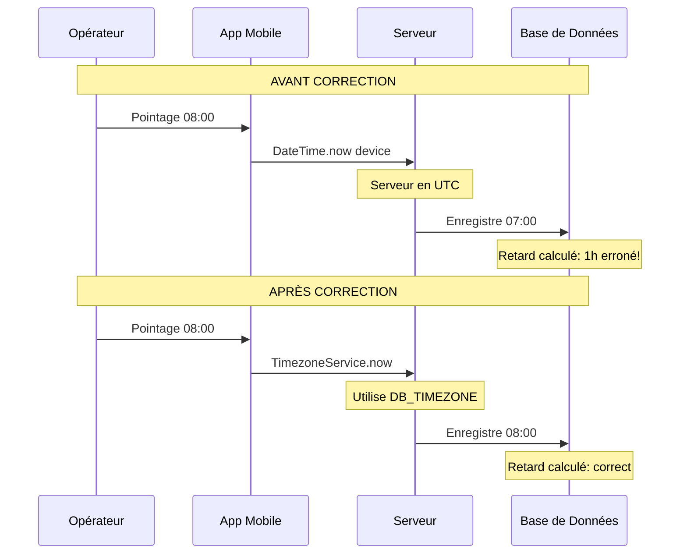
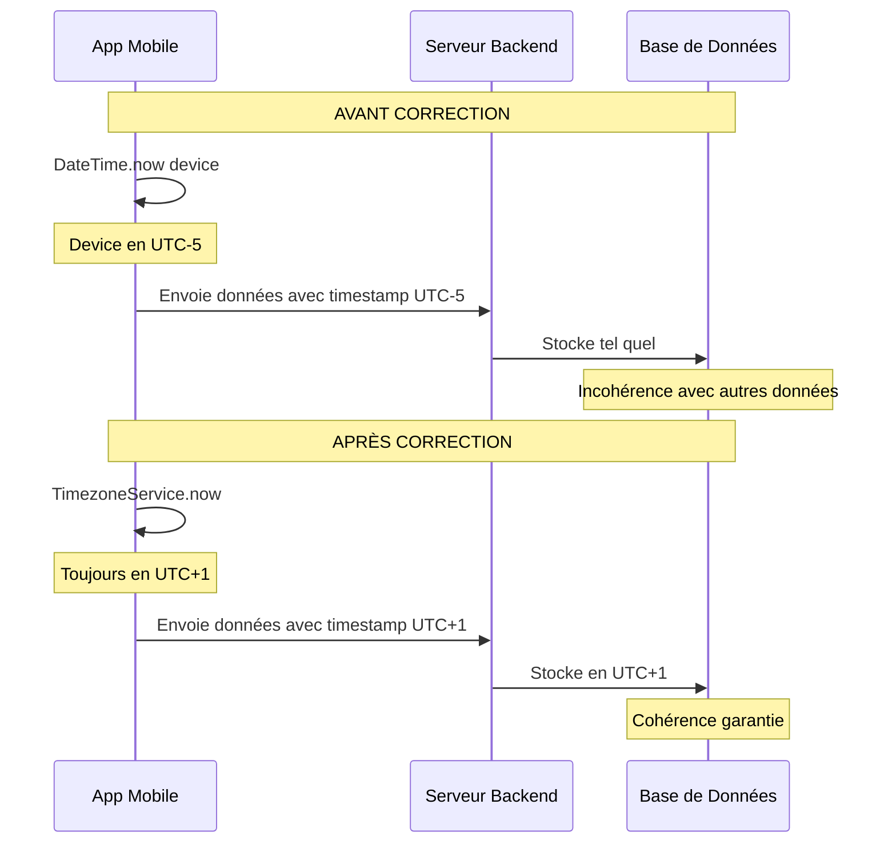
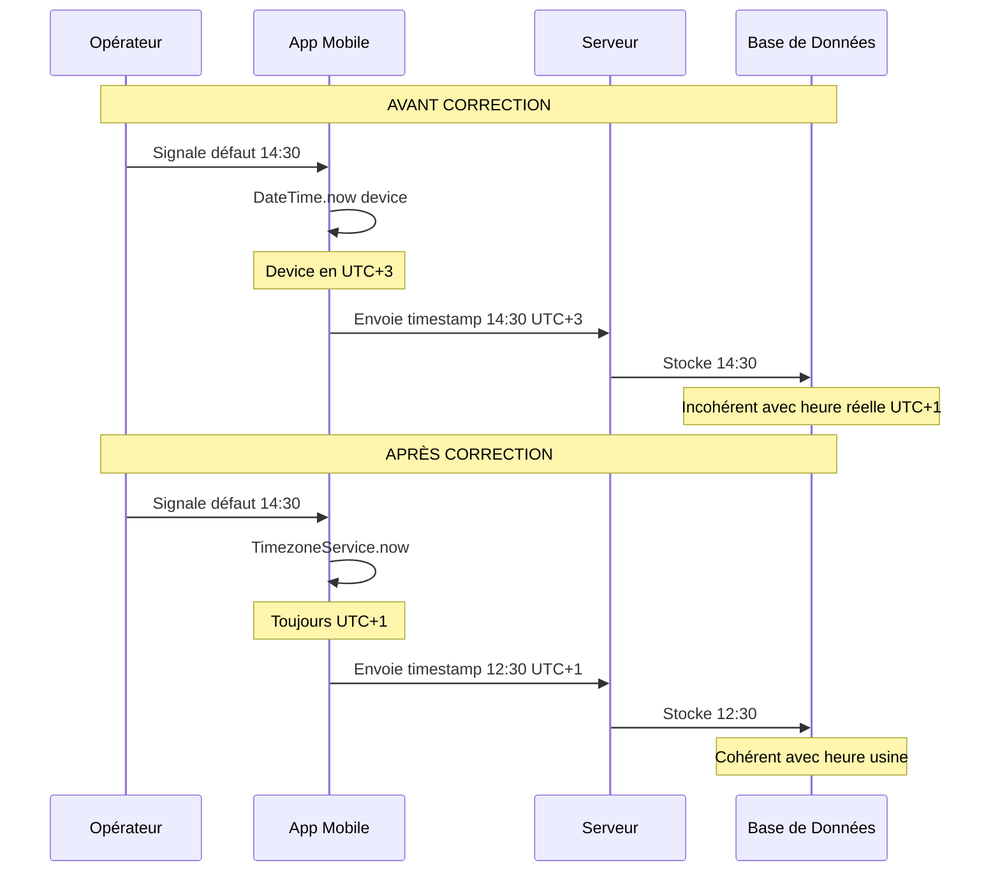

# Plan de Correction - Intégration Timezone Taskflow 2.0

## Table des Matières
1. [Vue d'ensemble](#1-vue-densemble)
2. [Corrections Backend](#2-corrections-backend)
3. [Corrections Application Mobile](#3-corrections-application-mobile)
4. [Scénarios d'Impact](#4-scénarios-dimpact)
5. [Ordre d'Implémentation](#5-ordre-dimplémentation)

---

## 1. Vue d'ensemble

### ⚠️ Source de Vérité Unique: Fichier `.env`

**La configuration du timezone est centralisée dans le fichier `.env`:**

```env
DB_TIMEZONE=+01:00
```

**Cette valeur est la référence unique pour tout le système:**
- ✅ Backend: Lit `process.env.DB_TIMEZONE` depuis `.env`
- ✅ Base de données: Utilise la même valeur pour la connexion MySQL
- ✅ Application mobile: Doit se synchroniser sur cette valeur (via API ou configuration)

> **Important**: Toute modification du timezone doit se faire uniquement dans le fichier `.env`. Le backend et l'application mobile doivent toujours se référer à cette valeur.

### État Actuel vs Cible

| Composant | État Actuel | État Cible |
|-----------|-------------|------------|
| Backend dates | Timezone serveur (variable) | Timezone depuis `.env` (DB_TIMEZONE) |
| App Mobile dates | Timezone device (variable) | Timezone synchronisé avec `.env` |
| Synchronisation | Risque de décalage | Cohérence garantie via `.env` |

---

## 2. Corrections Backend

### 2.1 Créer un utilitaire timezone centralisé

**Fichier à créer**: `backend/src/utils/datetime.js`

#### Impact Avant/Après

| Aspect | Avant | Après |
|--------|-------|-------|
| Heure de pointage | Dépend du timezone du serveur OS | Toujours en UTC+1 |
| Calcul de retard | Peut être erroné si serveur en UTC | Calcul correct selon l'horaire local |
| Export de dates | Format variable selon locale | Format ISO standardisé |

#### Code à implémenter

```javascript
// backend/src/utils/datetime.js
const TIMEZONE_OFFSET = process.env.DB_TIMEZONE || '+00:00';

/**
 * Parse le timezone configuré en heures
 * Ex: '+01:00' -> 1, '-05:00' -> -5
 */
function parseTimezoneOffset(tz) {
  const match = tz.match(/^([+-])(\d{2}):?(\d{2})$/);
  if (!match) return 0;
  const sign = match[1] === '+' ? 1 : -1;
  const hours = parseInt(match[2], 10);
  const minutes = parseInt(match[3], 10);
  return sign * (hours + minutes / 60);
}

const TIMEZONE_HOURS = parseTimezoneOffset(TIMEZONE_OFFSET);

/**
 * Retourne la date/heure actuelle dans le timezone configuré
 */
function getLocalDateTime() {
  const now = new Date();
  const utc = now.getTime() + (now.getTimezoneOffset() * 60000);
  return new Date(utc + (TIMEZONE_HOURS * 3600000));
}

/**
 * Formate une date pour MySQL (YYYY-MM-DD HH:mm:ss)
 */
function formatDateTimeForDB(date) {
  const d = date || getLocalDateTime();
  const yyyy = d.getFullYear();
  const mm = String(d.getMonth() + 1).padStart(2, '0');
  const dd = String(d.getDate()).padStart(2, '0');
  const hh = String(d.getHours()).padStart(2, '0');
  const mi = String(d.getMinutes()).padStart(2, '0');
  const ss = String(d.getSeconds()).padStart(2, '0');
  return `${yyyy}-${mm}-${dd} ${hh}:${mi}:${ss}`;
}

/**
 * Formate une date pour l'API (YYYY-MM-DD)
 */
function formatDateForAPI(date) {
  const d = date || getLocalDateTime();
  const yyyy = d.getFullYear();
  const mm = String(d.getMonth() + 1).padStart(2, '0');
  const dd = String(d.getDate()).padStart(2, '0');
  return `${yyyy}-${mm}-${dd}`;
}

/**
 * Formate l'heure actuelle (HH:mm:ss)
 */
function formatTimeForDB(date) {
  const d = date || getLocalDateTime();
  const hh = String(d.getHours()).padStart(2, '0');
  const mi = String(d.getMinutes()).padStart(2, '0');
  const ss = String(d.getSeconds()).padStart(2, '0');
  return `${hh}:${mi}:${ss}`;
}

/**
 * Convertit une date UTC en date locale
 */
function utcToLocal(utcDate) {
  const utc = new Date(utcDate);
  const local = new Date(utc.getTime() + (TIMEZONE_HOURS * 3600000));
  return local;
}

/**
 * Convertit une date locale en UTC
 */
function localToUtc(localDate) {
  const local = new Date(localDate);
  const utc = new Date(local.getTime() - (TIMEZONE_HOURS * 3600000));
  return utc;
}

module.exports = {
  TIMEZONE_OFFSET,
  TIMEZONE_HOURS,
  getLocalDateTime,
  formatDateTimeForDB,
  formatDateForAPI,
  formatTimeForDB,
  utcToLocal,
  localToUtc
};
```

---

### 2.2 Modifier le contrôleur de pointage

**Fichier à modifier**: `backend/src/controllers/pointage.controller.js`

#### Impact Avant/Après

| Scénario | Avant | Après |
|----------|-------|-------|
| Pointage arrivée 8h00 | Si serveur en UTC, enregistre 7h00 | Enregistre correctement 8h00 |
| Calcul retard | Peut afficher 1h de retard erroné | Calcul exact selon horaire |
| Pointage départ 17h00 | Peut enregistrer 16h00 | Enregistre correctement 17h00 |

#### Modifications requises

```javascript
// Ajouter en haut du fichier
const { getLocalDateTime, formatTimeForDB, formatDateForAPI } = require('../utils/datetime');

// Remplacer ligne 258-259
// AVANT:
const heureArrivee = new Date();
const heureArriveeStr = heureArrivee.toTimeString().split(' ')[0];

// APRÈS:
const heureArrivee = getLocalDateTime();
const heureArriveeStr = formatTimeForDB(heureArrivee);

// Remplacer ligne 382-383
// AVANT:
const heureDepart = new Date();
const heureDepartStr = heureDepart.toTimeString().split(' ')[0];

// APRÈS:
const heureDepart = getLocalDateTime();
const heureDepartStr = formatTimeForDB(heureDepart);
```

---

### 2.3 Modifier le contrôleur d'import

**Fichier à modifier**: `backend/src/controllers/import.controller.js`

#### Impact Avant/Après

| Scénario | Avant | Après |
|----------|-------|-------|
| Import planning | Dates potentiellement décalées | Dates correctes |
| Import pointage | Erreurs de jour possibles | Jours corrects |

#### Modifications requises

```javascript
// Ajouter en haut du fichier
const { formatDateForAPI, formatDateTimeForDB, utcToLocal } = require('../utils/datetime');

// Remplacer les appels toISOString() par formatDateForAPI()
// Exemple ligne 425-426:
// AVANT:
return value.toISOString().split('T')[0];

// APRÈS:
return formatDateForAPI(value);
```

---

### 2.4 Modifier le service d'export

**Fichier à modifier**: `backend/src/services/export.service.js`

#### Impact Avant/Après

| Scénario | Avant | Après |
|----------|-------|-------|
| Export Excel | Date selon locale serveur | Date en format local cohérent |
| Export PDF | Même problème | Format standardisé |

#### Modifications requises

```javascript
// Ajouter en haut du fichier
const { getLocalDateTime, formatDateForAPI } = require('../utils/datetime');

// Remplacer ligne 77:
// AVANT:
const dateRow = worksheet.addRow([`Généré le ${new Date().toLocaleDateString('fr-FR')}`]);

// APRÈS:
const dateRow = worksheet.addRow([`Généré le ${formatDateForAPI(getLocalDateTime())}`]);
```

---

## 3. Corrections Application Mobile

### 3.1 Ajouter les dépendances timezone

**Fichier à modifier**: `taskflow_mobile/pubspec.yaml`

#### Impact Avant/Après

| Aspect | Avant | Après |
|--------|-------|-------|
| Dépendance device | DateTime.now() = timezone device | DateTime.now() = timezone serveur |
| Parsing dates | Interprétation incorrecte possible | Conversion correcte |

#### Ajouter au pubspec.yaml

```yaml
dependencies:
  # ... existing dependencies
  timezone: ^0.9.2
  flutter_timezone: ^1.0.8
```

---

### 3.2 Créer un service timezone

**Fichier à créer**: `taskflow_mobile/lib/core/services/timezone_service.dart`

> **Note**: Le service timezone de l'application mobile doit récupérer la configuration depuis le backend via l'endpoint `/api/health` qui expose `DB_TIMEZONE`. Cela garantit que l'app mobile est toujours synchronisée avec la valeur définie dans `.env`.

#### Impact Avant/Après

| Scénario | Avant | Après |
|----------|-------|-------|
| Affichage heure | Heure device | Heure usine (UTC+1) |
| Enregistrement défaut | Timestamp device | Timestamp synchronisé |
| Demande intervention | Date/heure incohérente | Date/heure cohérente |

#### Code à implémenter

```dart
// taskflow_mobile/lib/core/services/timezone_service.dart
import 'package:timezone/timezone.dart' as tz;
import 'package:timezone/data/latest.dart' as tz_data;
import 'package:flutter_timezone/flutter_timezone.dart';
import 'package:dio/dio.dart';

class TimezoneService {
  // Timezone par défaut - sera mis à jour depuis le backend
  static String _serverTimezone = 'Africa/Lagos'; // UTC+1
  
  static bool _initialized = false;
  static late tz.Location _serverLocation;
  
  /// Initialise le service timezone en récupérant la config depuis le backend
  /// Le backend lit DB_TIMEZONE depuis .env et l'expose via /api/health
  static Future<void> initialize(Dio dio) async {
    if (_initialized) return;
    
    // Charger les données timezone
    tz_data.initializeTimeZoning();
    
    // Récupérer le timezone depuis le backend (qui lit .env)
    try {
      final response = await dio.get('/api/health');
      final timezone = response.data?['timezone'] as String?;
      if (timezone != null && timezone.isNotEmpty) {
        _serverTimezone = _mapTimezoneToLocation(timezone);
      }
    } catch (e) {
      // Fallback: utiliser la valeur par défaut
      print('⚠️ Impossible de récupérer le timezone du serveur, utilisation de la valeur par défaut');
    }
    
    // Obtenir le timezone du serveur
    _serverLocation = tz.getLocation(_serverTimezone);
    
    _initialized = true;
  }
  
  /// Map un offset timezone (+01:00) vers un nom de location IANA
  static String _mapTimezoneToLocation(String offset) {
    // Mapping des offsets courants vers les locations IANA
    final mapping = {
      '+00:00': 'UTC',
      '+01:00': 'Africa/Lagos',  // ou 'Europe/Paris'
      '+02:00': 'Africa/Cairo',
      '-05:00': 'America/New_York',
      '-08:00': 'America/Los_Angeles',
    };
    return mapping[offset] ?? 'Africa/Lagos';
  }
  
  /// Retourne l'heure actuelle dans le timezone du serveur
  static DateTime now() {
    if (!_initialized) {
      // Fallback: ajouter +1h à UTC
      return DateTime.now().toUtc().add(const Duration(hours: 1));
    }
    return tz.TZDateTime.now(_serverLocation);
  }
  
  /// Convertit une date UTC en date locale serveur
  static DateTime fromUtc(DateTime utcDate) {
    if (!_initialized) {
      return utcDate.add(const Duration(hours: 1));
    }
    return tz.TZDateTime.from(utcDate, _serverLocation);
  }
  
  /// Convertit une date locale serveur en UTC
  static DateTime toUtc(DateTime localDate) {
    if (!_initialized) {
      return localDate.subtract(const Duration(hours: 1));
    }
    return tz.TZDateTime.from(localDate, tz.UTC);
  }
  
  /// Parse une date string du serveur
  static DateTime? parseServerDateTime(String? dateStr) {
    if (dateStr == null || dateStr.isEmpty) return null;
    
    final parsed = DateTime.tryParse(dateStr);
    if (parsed == null) return null;
    
    // Si la date est en UTC (se termine par Z ou +00:00)
    if (dateStr.endsWith('Z') || dateStr.endsWith('+00:00')) {
      return fromUtc(parsed);
    }
    
    return parsed;
  }
  
  /// Formate une date pour l'API
  static String formatForApi(DateTime date) {
    final utc = toUtc(date);
    return utc.toIso8601String();
  }
  
  /// Formate une date pour l'affichage
  static String formatForDisplay(DateTime date) {
    final local = fromUtc(date);
    return '${local.day.toString().padLeft(2, '0')}/'
           '${local.month.toString().padLeft(2, '0')}/'
           '${local.year} '
           '${local.hour.toString().padLeft(2, '0')}:'
           '${local.minute.toString().padLeft(2, '0')}';
  }
}
```

---

### 3.3 Modifier les providers utilisant DateTime.now()

**Fichiers à modifier**:
- `taskflow_mobile/lib/features/operator/defects/controllers/defects_process_provider.dart`
- `taskflow_mobile/lib/data/repositories/intervention_repository.dart`
- `taskflow_mobile/lib/data/repositories/defauts_process_repository.dart`

#### Impact Avant/Après

| Scénario | Avant | Après |
|----------|-------|-------|
| Enregistrement défaut | Heure device | Heure usine synchronisée |
| Création intervention | Timestamp incorrect possible | Timestamp correct |

#### Exemple de modification

```dart
// defects_process_provider.dart

// AVANT:
now: DateTime.now(),
dateEnregistrement: DateTime.now(),

// APRÈS:
import '../../../core/services/timezone_service.dart';

now: TimezoneService.now(),
dateEnregistrement: TimezoneService.now(),
```

---

### 3.4 Modifier les modèles de parsing de dates

**Fichiers à modifier**:
- `taskflow_mobile/lib/domain/models/intervention.dart`
- `taskflow_mobile/lib/domain/models/task.dart`
- `taskflow_mobile/lib/domain/models/user_context.dart`

#### Impact Avant/Après

| Scénario | Avant | Après |
|----------|-------|-------|
| Affichage date intervention | Peut être décalée | Toujours correcte |
| Calcul durée tâche | Peut être erroné | Calcul exact |

#### Exemple de modification

```dart
// intervention.dart

// AVANT:
dateDemande: DateTime.tryParse(
    (json['Date_heure_demande'] ?? json['dateDemande'] ?? '')
        .toString()) ??
    DateTime.now(),

// APRÈS:
import '../../core/services/timezone_service.dart';

dateDemande: TimezoneService.parseServerDateTime(
    (json['Date_heure_demande'] ?? json['dateDemande'] ?? '').toString()
) ?? TimezoneService.now(),
```

---

## 4. Scénarios d'Impact

### 4.1 Scénario: Pointage Arrivée



### 4.2 Scénario: Synchronisation Mobile



### 4.3 Scénario: Enregistrement Défaut



---

## 5. Ordre d'Implémentation

### Phase 1: Backend Core (Priorité Critique)

| # | Tâche | Fichier | Impact |
|---|-------|---------|--------|
| 1.1 | Créer utilitaire datetime | `backend/src/utils/datetime.js` | Nouveau |
| 1.2 | Modifier pointage.controller | `backend/src/controllers/pointage.controller.js` | Modification |
| 1.3 | Modifier import.controller | `backend/src/controllers/import.controller.js` | Modification |
| 1.4 | Modifier export.service | `backend/src/services/export.service.js` | Modification |

### Phase 2: Application Mobile (Priorité Haute)

| # | Tâche | Fichier | Impact |
|---|-------|---------|--------|
| 2.1 | Ajouter dépendances | `taskflow_mobile/pubspec.yaml` | Dépendance |
| 2.2 | Créer TimezoneService | `taskflow_mobile/lib/core/services/timezone_service.dart` | Nouveau |
| 2.3 | Modifier defects_process_provider | `lib/features/operator/defects/controllers/` | Modification |
| 2.4 | Modifier intervention_repository | `lib/data/repositories/` | Modification |
| 2.5 | Modifier modèles | `lib/domain/models/` | Modification |

### Phase 3: Tests et Validation

| # | Tâche | Description |
|---|-------|-------------|
| 3.1 | Tests unitaires backend | Tester datetime.js avec différents timezones |
| 3.2 | Tests d'intégration | Vérifier la cohérence des timestamps |
| 3.3 | Tests mobile | Valider l'affichage des dates sur device |

---

## 6. Checklist de Validation

### Backend
- [ ] `DB_TIMEZONE` correctement lu depuis `.env`
- [ ] `getLocalDateTime()` retourne l'heure en UTC+1
- [ ] Pointage enregistre l'heure correcte
- [ ] Import/Export utilise le bon timezone

### Application Mobile
- [ ] Package `timezone` installé
- [ ] `TimezoneService` initialisé au démarrage
- [ ] `TimezoneService.now()` retourne UTC+1
- [ ] Dates affichées correctement

### Intégration
- [ ] Timestamps cohérents entre backend et mobile
- [ ] Pas de décalage horaire dans les pointages
- [ ] Calculs de durée corrects

---

## 7. Résumé des Fichiers à Modifier

### Nouveaux Fichiers
| Fichier | Description |
|---------|-------------|
| `backend/src/utils/datetime.js` | Utilitaire timezone centralisé |
| `taskflow_mobile/lib/core/services/timezone_service.dart` | Service timezone Flutter |

### Fichiers Modifiés
| Fichier | Modifications |
|---------|---------------|
| `backend/src/controllers/pointage.controller.js` | Utiliser datetime.js |
| `backend/src/controllers/import.controller.js` | Utiliser datetime.js |
| `backend/src/services/export.service.js` | Utiliser datetime.js |
| `taskflow_mobile/pubspec.yaml` | Ajouter dépendances timezone |
| `taskflow_mobile/lib/features/operator/defects/controllers/defects_process_provider.dart` | Utiliser TimezoneService |
| `taskflow_mobile/lib/data/repositories/intervention_repository.dart` | Utiliser TimezoneService |
| `taskflow_mobile/lib/domain/models/intervention.dart` | Parser avec TimezoneService |
| `taskflow_mobile/lib/domain/models/task.dart` | Parser avec TimezoneService |

---

## 8. Notes Importantes

### Test du Timezone
Pour vérifier que le timezone fonctionne correctement:

```javascript
// Test backend
const { getLocalDateTime, formatTimeForDB } = require('./src/utils/datetime');
console.log('Heure locale:', formatTimeForDB(getLocalDateTime()));
console.log('DB_TIMEZONE:', process.env.DB_TIMEZONE);
```

```dart
// Test mobile
import 'package:taskflow_mobile/core/services/timezone_service.dart';

void main() async {
  await TimezoneService.initialize();
  print('Heure serveur: ${TimezoneService.now()}');
}
```

### Points d'Attention
1. Le timezone `Africa/Lagos` correspond à UTC+1 (même fuseau que Paris en hiver)
2. Si le serveur change de timezone, redémarrer l'application pour recharger `.env`
3. Les dates dans la base de données sont stockées selon le timezone MySQL configuré