# Analyse de l'Intégration du Timezone dans Taskflow 2.0

## Résumé Exécutif

Cette analyse examine l'intégration de la configuration `DB_TIMEZONE=+01:00` dans le projet Taskflow 2.0, couvrant le backend Node.js, l'application mobile Flutter, et l'intégration Firebase pour les notifications.

---

## 1. Configuration Actuelle

### 1.1 Fichier .env
```env
DB_TIMEZONE=+01:00
```
✅ **Correct**: La variable est correctement définie pour le fuseau horaire UTC+1.

### 1.2 Configuration Base de Données
**Fichier**: [`backend/src/config/database.js`](backend/src/config/database.js)

```javascript
const pool = mysql.createPool({
  host: process.env.DB_HOST,
  user: process.env.DB_USER,
  password: process.env.DB_PASSWORD,
  database: process.env.DB_NAME,
  timezone: process.env.DB_TIMEZONE || '+00:00',  // ✅ Utilise DB_TIMEZONE
  dateStrings: true,  // ⚠️ Retourne les dates comme strings
  waitForConnections: true,
  connectionLimit: 50,
  queueLimit: 0
});
```

✅ **Correct**: Le timezone est bien lu depuis `.env`
⚠️ **Attention**: `dateStrings: true` retourne les dates comme strings SQL brutes

---

## 2. Problèmes Identifiés

### 2.1 Backend - Gestion Incohérente des Dates

#### Problème N°1: Utilisation de `new Date()` sans timezone
**Fichier**: [`backend/src/controllers/pointage.controller.js`](backend/src/controllers/pointage.controller.js:258)

```javascript
// ❌ PROBLÈME: Utilise le timezone du serveur, pas DB_TIMEZONE
const heureArrivee = new Date();
const heureArriveeStr = heureArrivee.toTimeString().split(' ')[0];
```

**Impact**: Si le serveur est dans un fuseau différent de +01:00, les heures de pointage seront incorrectes.

#### Problème N°2: Conversion UTC avec `toISOString()`
**Fichiers concernés**:
- [`backend/src/controllers/import.controller.js`](backend/src/controllers/import.controller.js:425)
- [`backend/src/controllers/planningHebdo.controller.js`](backend/src/controllers/planningHebdo.controller.js:8)

```javascript
// ❌ PROBLÈME: Convertit en UTC, perd le timezone local
return value.toISOString().split('T')[0];
```

**Impact**: Les dates peuvent être décalées d'un jour selon l'heure d'enregistrement.

#### Problème N°3: Utilisation de `toLocaleDateString()`
**Fichier**: [`backend/src/services/export.service.js`](backend/src/services/export.service.js:77)

```javascript
// ⚠️ Dépend de la locale du serveur
const dateRow = worksheet.addRow([`Généré le ${new Date().toLocaleDateString('fr-FR')}`]);
```

---

### 2.2 Application Mobile Flutter

#### Problème N°4: Absence de package timezone
**Fichier**: [`taskflow_mobile/pubspec.yaml`](taskflow_mobile/pubspec.yaml)

❌ **Manquant**: Aucun package de gestion de timezone n'est installé:
- `timezone` - Pour la manipulation des fuseaux horaires
- `flutter_timezone` - Pour détecter le timezone du device

#### Problème N°5: Utilisation de `DateTime.now()` sans timezone
**Fichiers concernés**:
- [`taskflow_mobile/lib/features/operator/defects/controllers/defects_process_provider.dart`](taskflow_mobile/lib/features/operator/defects/controllers/defects_process_provider.dart:70)
- [`taskflow_mobile/lib/data/repositories/intervention_repository.dart`](taskflow_mobile/lib/data/repositories/intervention_repository.dart:172)

```dart
// ❌ PROBLÈME: Utilise le timezone du device
now: DateTime.now(),
dateDemande: DateTime.now(),
```

**Impact**: Si le device est dans un fuseau différent, les timestamps seront incohérents avec le backend.

#### Problème N°6: Parsing des dates sans timezone
**Fichier**: [`taskflow_mobile/lib/domain/models/intervention.dart`](taskflow_mobile/lib/domain/models/intervention.dart:65)

```dart
// ⚠️ Parse sans information de timezone
dateDemande: DateTime.tryParse(
    (json['Date_heure_demande'] ?? json['dateDemande'] ?? '')
        .toString()) ??
    DateTime.now(),
```

---

### 2.3 Intégration Firebase/FCM

#### Problème N°7: Backend sans Firebase Admin SDK
**Fichier**: [`backend/package.json`](backend/package.json)

❌ **Manquant**: Le package `firebase-admin` n'est pas installé.

```json
{
  "dependencies": {
    "bcryptjs": "^3.0.3",
    "cors": "^2.8.5",
    // ... firebase-admin MANQUANT
  }
}
```

#### Problème N°8: Endpoints FCM manquants
**Fichier**: [`taskflow_mobile/lib/data/remote/services/intervention_service.dart`](taskflow_mobile/lib/data/remote/services/intervention_service.dart:127)

```dart
// Le mobile essaie d'enregistrer le token FCM
Future<bool> registerFcmToken(String token) async {
  try {
    await _dio.post('/api/auth/fcm-token', data: payload);  // ❌ Endpoint inexistant
  } catch (_) {
    await _dio.post('/api/notifications/token', data: payload);  // ❌ Endpoint inexistant
  }
}
```

**Impact**: Les tokens FCM ne peuvent pas être enregistrés côté serveur.

#### Problème N°9: Pas d'envoi de notifications
Le backend n'a aucune implémentation pour envoyer des notifications Firebase.

---

## 3. Architecture Actuelle vs Attendue

```mermaid
flowchart TB
    subgraph Current[Architecture Actuelle]
        direction TB
        DB[(MySQL<br/>DB_TIMEZONE=+01:00)]
        Backend[Backend Node.js<br/>new Date - timezone serveur]
        Mobile[App Flutter<br/>DateTime.now - timezone device]
        Firebase[Firebase FCM<br/>Non intégré]
        
        DB <--> Backend
        Backend <--> Mobile
        Mobile -.-> Firebase
    end
    
    subgraph Issues[Problèmes]
        I1[Timezone Serveur<br/>vs DB_TIMEZONE]
        I2[Timezone Device<br/>vs DB_TIMEZONE]
        I3[Pas de Firebase Admin]
        I4[Endpoints FCM manquants]
    end
    
    Current --> Issues
```



---

## 4. Recommandations

### 4.1 Backend - Priorité Haute

#### R1: Créer un utilitaire de timezone
```javascript
// backend/src/utils/datetime.js
const TIMEZONE_OFFSET = process.env.DB_TIMEZONE || '+00:00';

function getLocalDateTime() {
  const now = new Date();
  // Ajuster selon DB_TIMEZONE
  const offset = parseInt(TIMEZONE_OFFSET.replace('+', '').replace(':', ''));
  const utc = now.getTime() + (now.getTimezoneOffset() * 60000);
  return new Date(utc + (offset * 3600000));
}

function formatDateForDB(date) {
  const d = date || getLocalDateTime();
  return d.toISOString().slice(0, 19).replace('T', ' ');
}

function formatDateForAPI(date) {
  const d = date || getLocalDateTime();
  return d.toISOString().split('T')[0];
}
```

#### R2: Installer Firebase Admin SDK
```bash
cd backend
npm install firebase-admin
```

#### R3: Créer les endpoints FCM
```javascript
// backend/src/routes/notifications.routes.js
router.post('/token', authMiddleware, registerFcmToken);
router.post('/token/unregister', authMiddleware, unregisterFcmToken);
```

### 4.2 Application Mobile - Priorité Haute

#### R4: Ajouter les packages timezone
```yaml
# taskflow_mobile/pubspec.yaml
dependencies:
  timezone: ^0.9.2
  flutter_timezone: ^1.0.8
```

#### R5: Créer un service de timezone
```dart
// taskflow_mobile/lib/core/services/timezone_service.dart
class TimezoneService {
  static const String serverTimezone = 'Africa/Lagos'; // UTC+1
  
  static DateTime nowInServerTimezone() {
    final location = tz.getLocation(serverTimezone);
    return tz.TZDateTime.now(location);
  }
  
  static DateTime parseServerDateTime(String isoString) {
    final utc = DateTime.parse(isoString);
    return utc.add(const Duration(hours: 1)); // UTC+1
  }
}
```

### 4.3 Synchronisation Backend-Mobile

#### R6: Ajouter un endpoint de temps serveur
```javascript
// GET /api/health
router.get('/health', (req, res) => {
  res.json({ 
    status: 'OK', 
    database: process.env.DB_NAME,
    timezone: process.env.DB_TIMEZONE,
    serverTime: new Date().toISOString(),
    serverLocalTime: formatDateForDB()
  });
});
```

---

## 5. Plan d'Implémentation

| Priorité | Tâche | Fichier(s) | Impact |
|----------|-------|------------|--------|
| 🔴 Haute | Créer utilitaire timezone backend | `backend/src/utils/datetime.js` | Nouveau |
| 🔴 Haute | Installer firebase-admin | `backend/package.json` | Dépendance |
| 🔴 Haute | Créer endpoints FCM | `backend/src/routes/notifications.routes.js` | Nouveau |
| 🟡 Moyenne | Ajouter packages timezone Flutter | `pubspec.yaml` | Dépendance |
| 🟡 Moyenne | Créer service timezone Flutter | `lib/core/services/timezone_service.dart` | Nouveau |
| 🟡 Moyenne | Refactor pointage.controller.js | `backend/src/controllers/pointage.controller.js` | Modification |
| 🟢 Basse | Ajouter endpoint temps serveur | `backend/src/routes/index.js` | Modification |
| 🟢 Basse | Tests d'intégration timezone | `backend/src/tests/` | Nouveau |

---

## 6. Conclusion

La configuration `DB_TIMEZONE=+01:00` est correctement définie dans le fichier `.env` et utilisée dans la configuration MySQL, mais elle n'est pas appliquée de manière cohérente dans le code backend et l'application mobile.

**Points critiques à corriger**:
1. Le backend utilise `new Date()` qui dépend du timezone du serveur
2. L'app mobile utilise `DateTime.now()` qui dépend du timezone du device
3. L'intégration Firebase FCM est incomplète (pas de firebase-admin, pas d'endpoints)

**Risque principal**: Des incohérences de dates/heures entre le backend, la base de données et les appareils mobiles, pouvant entraîner des erreurs dans les pointages, plannings et notifications.
