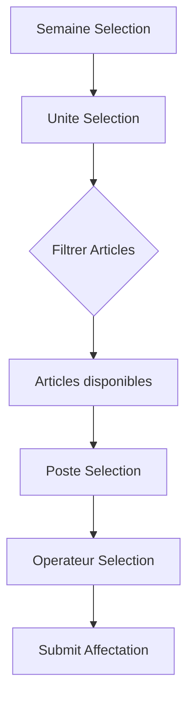

# Plan: Nouvelle Fonctionnalité d'Affectation - TaskFlow Mobile

## Résumé
Ce plan décrit les modifications nécessaires pour implémenter la nouvelle fonctionnalité d'affectation dans l'application mobile TaskFlow, avec une structure de champs modifiée et des filtres en cascade.

## Analyse de l'Existant

### Structure Actuelle
L'application mobile dispose déjà d'une page d'affectation (`new_task_page.dart`) avec les champs:
- Semaine (de production)
- Article
- Poste de travail
- Opérateur

### Tables de Base de Données Concernées
| Table | Colonnes Clés |
|-------|---------------|
| `commandes` | ID, Code_article, Unite_production, ID_Semaine |
| `semaines` | ID, Code_semaine, Numero_semaine, Annee |
| `personnel` | ID, Nom_prenom, Matricule, Poste, Site_affectation |
| `postes` | ID, Description |
| `articles` | ID, Code_article, Client |
| `affectations` | ID, ID_Commande, ID_Operateur, ID_Poste, ID_Article, ID_Semaine |

---

## Nouveaux Requirements

### Champs du Formulaire
1. **Semaine** - Select distinct Code_semaine depuis commandes, affiché comme "S08 - 2026"
2. **Unité** - Select distinct Unite_production depuis commandes
3. **Article** - Code_article depuis articles, filtré par semaine ET unité sélectionnées
4. **Poste** - Description depuis postes
5. **Opérateur** - Matricule + Nom_prenom depuis personnel

### Comportement des Filtres en Cascade



### Suppression
- Supprimer la section "Tâches Récentes" de la page d'affectation

---

## Plan d'Implémentation

### Phase 1: Backend API

#### 1.1 Nouvel Endpoint: Semaines avec Commandes
**Fichier**: `backend/src/controllers/commande.controller.js` ou `semaines.controller.js`

```javascript
// GET /api/commandes/semaines-disponibles
// Retourne les semaines distinctes qui ont des commandes
exports.getSemainesAvecCommandes = async (req, res) => {
  const [rows] = await db.query(`
    SELECT DISTINCT s.ID, s.Code_semaine, s.Numero_semaine, s.Annee
    FROM semaines s
    INNER JOIN commandes c ON c.ID_Semaine = s.ID
    ORDER BY s.Annee DESC, s.Numero_semaine DESC
  `);
  // Format: S08 - 2026
};
```

#### 1.2 Nouvel Endpoint: Articles par Semaine et Unité
**Fichier**: `backend/src/controllers/commande.controller.js`

```javascript
// GET /api/commandes/articles-filtres?semaineId=X&unite=Y
// Retourne les articles filtrés par semaine ET unité
exports.getArticlesFiltres = async (req, res) => {
  const { semaineId, unite } = req.query;
  const [rows] = await db.query(`
    SELECT DISTINCT a.ID, a.Code_article
    FROM articles a
    INNER JOIN commandes c ON c.ID_Article = a.ID
    WHERE c.ID_Semaine = ? AND c.Unite_production = ?
  `, [semaineId, unite]);
};
```

#### 1.3 Endpoint Existant: Unités de Production
L'endpoint existe déjà: `GET /api/commandes/unites`

#### 1.4 Mise à jour: Création d'Affectation
**Fichier**: `backend/src/controllers/affectation.controller.js`

Modifier `createAffectation` pour:
- Accepter ID_Semaine, ID_Article, ID_Poste, ID_Operateur
- Rendre ID_Commande optionnel (peut être déduit des filtres)

---

### Phase 2: Mobile App - Models

#### 2.1 Modèle Semaine (Mise à jour)
**Fichier**: `lib/domain/models/semaine.dart`

```dart
class Semaine extends Equatable {
  const Semaine({
    required this.id,
    required this.codeSemaine,  // ex: S08
    required this.numeroSemaine,
    required this.annee,
  });
  
  // Label formaté: S08 - 2026
  String get label => 'S$numeroSemaine - $annee';
}
```

#### 2.2 Nouveau Modèle: Unite
**Fichier**: `lib/domain/models/unite.dart`

```dart
class Unite extends Equatable {
  const Unite({required this.id, required this.nom});
  
  final String id;
  final String nom;
}
```

---

### Phase 3: Mobile App - Services

#### 3.1 Task Service (Mise à jour)
**Fichier**: `lib/data/remote/services/task_service.dart`

Ajouter les méthodes:
```dart
Future<List<Semaine>> getSemainesAvecCommandes();
Future<List<Unite>> getUnitesProduction();
Future<List<Article>> getArticlesFiltres(String semaineId, String unite);
```

---

### Phase 4: Mobile App - Provider

#### 4.1 New Task Provider (Refonte)
**Fichier**: `lib/features/operator/task/controllers/new_task_provider.dart`

Nouveau State:
```dart
class NewTaskState {
  final bool isLoading;
  final bool isSubmitting;
  
  // Données disponibles
  final List<Semaine> semaines;
  final List<Unite> unites;
  final List<Article> articles;
  final List<Poste> postes;
  final List<Operateur> operateurs;
  
  // Sélections
  final Semaine? selectedSemaine;
  final Unite? selectedUnite;
  final Article? selectedArticle;
  final Poste? selectedPoste;
  final Operateur? selectedOperateur;
  
  // Validation
  bool get isValid =>
    selectedSemaine != null &&
    selectedUnite != null &&
    selectedArticle != null &&
    selectedPoste != null &&
    selectedOperateur != null;
}
```

Logique de cascade:
1. Au chargement: Fetch semaines, postes, operateurs
2. Sélection semaine: Reset unite, article; Fetch unites pour cette semaine
3. Sélection unité: Reset article; Fetch articles filtrés
4. Sélection article: Valide
5. Sélection poste: Valide
6. Sélection opérateur: Valide

---

### Phase 5: Mobile App - UI

#### 5.1 Design System - Composant de Sélection Interactif

**Nouveau Widget**: `SelectionField` - Un champ de sélection interactif personnalisé

**Caractéristiques du Design**:
```
┌─────────────────────────────────────────────────────┐
│  📷  │  S08 - 2026                         │  ▼  │
└─────────────────────────────────────────────────────┘
```

**Spécifications**:
- **Conteneur**: Bords arrondis (12px), bordure colorée (2px), ombre légère
- **Zone de texte**: Lecture seule avec libellé de la sélection
- **Bouton QR (gauche)**: Icône de scan pour recherche par code/matricule
- **Flèche déroulante (droite)**: Ouvre une modale de sélection avec recherche textuelle

**Comportement**:
1. **Scan QR**: Déclenche le scanner pour saisie rapide par code
2. **Flèche ▼**: Ouvre une modale avec:
   - Barre de recherche textuelle
   - Liste des options disponibles
   - Filtrage en temps réel

**Fichier**: `lib/core/widgets/selection_field.dart`

```dart
class SelectionField<T> extends StatelessWidget {
  final String label;
  final T? value;
  final String Function(T) displayText;
  final Future<void> Function()? onScanQr;
  final VoidCallback onTap;
  final bool enableQrScan;
  
  // Design constants
  static const double borderRadius = 12.0;
  static const double borderWidth = 2.0;
  static const Color borderColor = Color(0xFF2A7BFF);
  static const List<BoxShadow> boxShadow = [
    BoxShadow(
      color: Color(0x1A000000),
      blurRadius: 8,
      offset: Offset(0, 2),
    ),
  ];
}
```

#### 5.2 Modale de Sélection
**Fichier**: `lib/core/widgets/selection_modal.dart`

```
┌─────────────────────────────────────┐
│  🔍 Rechercher...                   │
├─────────────────────────────────────┤
│  ○ S08 - 2026                       │
│  ○ S09 - 2026                       │
│  ○ S10 - 2026                       │
│  ○ S11 - 2026                       │
│  ...                                │
└─────────────────────────────────────┘
```

#### 5.3 New Task Page (Refonte)
**Fichier**: `lib/features/operator/task/views/new_task_page.dart`

Structure de l'UI avec le nouveau design:
```
┌─────────────────────────────────────────────────────┐
│ NOUVELLE AFFECTATION                        [?]     │
├─────────────────────────────────────────────────────┤
│ TIMELINE                                            │
│ ┌─────────────────────────────────────────────────┐ │
│ │ SEMAINE DE PRODUCTION                           │ │
│ │ ┌─────────────────────────────────────────────┐ │ │
│ │ │ 📷 │ S08 - 2026                      │ ▼  │ │ │
│ │ └─────────────────────────────────────────────┘ │ │
│ └─────────────────────────────────────────────────┘ │
├─────────────────────────────────────────────────────┤
│ DETAILS DE LA TACHE                                │
│ ┌─────────────────────────────────────────────────┐ │
│ │ UNITE                                           │ │
│ │ ┌─────────────────────────────────────────────┐ │ │
│ │ │ 📷 │ Unité 1                          │ ▼  │ │ │
│ │ └─────────────────────────────────────────────┘ │ │
│ │                                                 │ │
│ │ ARTICLE / REFERENCE                             │ │
│ │ ┌─────────────────────────────────────────────┐ │ │
│ │ │ 📷 │ AL-9920-X - Boitier...          │ ▼  │ │ │
│ │ └─────────────────────────────────────────────┘ │ │
│ │                                                 │ │
│ │ POSTE DE TRAVAIL                                │ │
│ │ ┌─────────────────────────────────────────────┐ │ │
│ │ │ 📷 │ Ligne A - Assemblage            │ ▼  │ │ │
│ │ └─────────────────────────────────────────────┘ │ │
│ └─────────────────────────────────────────────────┘ │
├─────────────────────────────────────────────────────┤
│ PERSONNEL                                           │
│ ┌─────────────────────────────────────────────────┐ │
│ │ OPERATEUR (BADGE)                               │ │
│ │ ┌─────────────────────────────────────────────┐ │ │
│ │ │ 📷 │ Marc Johnson (OP-782)            │ ▼  │ │ │
│ │ └─────────────────────────────────────────────┘ │ │
│ └─────────────────────────────────────────────────┘ │
├─────────────────────────────────────────────────────┤
│                                                     │
│     [✓ CONFIRMER L'AFFECTATION]                    │
│                                                     │
└─────────────────────────────────────────────────────┘
```

**Note**: Section "RECENT" supprimée

#### 5.4 Style Guide pour les Champs

| Propriété | Valeur |
|-----------|--------|
| Border Radius | 12px |
| Border Width | 2px |
| Border Color | #2A7BFF (bleu) |
| Shadow | 0px 2px 8px rgba(0,0,0,0.1) |
| Background | #1A2C4B (dark mode) |
| Text Color | #E8EEF8 |
| Label Color | #8EA2C3 |
| Icon Color | #2A7BFF |
| Height | 56px |
| Padding | 12px horizontal |

---

## Ordre des Tâches

### Backend (Node.js)
1. [ ] Ajouter endpoint `GET /api/commandes/semaines-disponibles`
2. [ ] Ajouter endpoint `GET /api/commandes/articles-filtres`
3. [ ] Vérifier que `GET /api/commandes/unites` fonctionne correctement
4. [ ] Optionnel: Modifier `createAffectation` pour auto-déduire ID_Commande

### Mobile (Flutter)
5. [ ] Créer modèle `Unite`
6. [ ] Mettre à jour modèle `Semaine` avec format d'affichage
7. [ ] Ajouter méthodes dans `task_service.dart`
8. [ ] Refactorer `new_task_provider.dart` avec nouveaux champs et logique cascade
9. [ ] Mettre à jour `new_task_page.dart`:
   - Ajouter dropdown Unité
   - Réorganiser l'ordre des champs
   - Supprimer section "Recent Tasks"
10. [ ] Tester le flux complet

---

## Diagramme de Flux de Données

```mermaid
sequenceDiagram
    participant App as Mobile App
    participant API as Backend API
    participant DB as Database
    
    App->>API: GET /semaines-disponibles
    API->>DB: SELECT DISTINCT semaines FROM commandes
    DB-->>API: Liste semaines
    API-->>App: Semaines[]
    
    App->>API: GET /unites
    API->>DB: SELECT DISTINCT Unite_production
    DB-->>API: Liste unités
    API-->>App: Unites[]
    
    User selects Semaine + Unite
    
    App->>API: GET /articles-filtres?semaine=X&unite=Y
    API->>DB: SELECT articles WHERE semaine AND unite
    DB-->>API: Articles filtrés
    API-->>App: Articles[]
    
    User fills remaining fields
    
    App->>API: POST /affectations
    API->>DB: INSERT INTO affectations
    DB-->>API: Success
    API-->>App: Affectation créée
```

---

## Points d'Attention

1. **Gestion des erreurs**: Prévoir des messages clairs si aucun article n'est disponible pour une combinaison semaine/unité

2. **Offline mode**: Les listes de référence (semaines, unités, postes, opérateurs) devraient être mises en cache

3. **Performance**: Utiliser des requêtes optimisées avec INDEX sur les colonnes de filtrage

4. **Validation**: 
   - Vérifier que la combinaison semaine/unité/article est valide
   - Vérifier qu'un opérateur n'a pas déjà une affectation en cours

---

## Fichiers à Modifier/Créer

### Backend
| Fichier | Action |
|---------|--------|
| `backend/src/controllers/commande.controller.js` | Ajouter 2 endpoints |
| `backend/src/routes/commande.routes.js` | Ajouter routes |
| `backend/src/controllers/affectation.controller.js` | Optionnel: modifier create |

### Mobile
| Fichier | Action |
|---------|--------|
| `lib/core/widgets/selection_field.dart` | Créer - Nouveau composant de sélection |
| `lib/core/widgets/selection_modal.dart` | Créer - Modale de recherche |
| `lib/domain/models/unite.dart` | Créer |
| `lib/domain/models/semaine.dart` | Modifier |
| `lib/data/remote/services/task_service.dart` | Ajouter méthodes |
| `lib/data/repositories/task_repository.dart` | Ajouter méthodes |
| `lib/features/operator/task/controllers/new_task_provider.dart` | Refactorer |
| `lib/features/operator/task/views/new_task_page.dart` | Refactorer UI |
| `lib/features/operator/task/widgets/recent_task_tile.dart` | Supprimer (non utilisé) |
