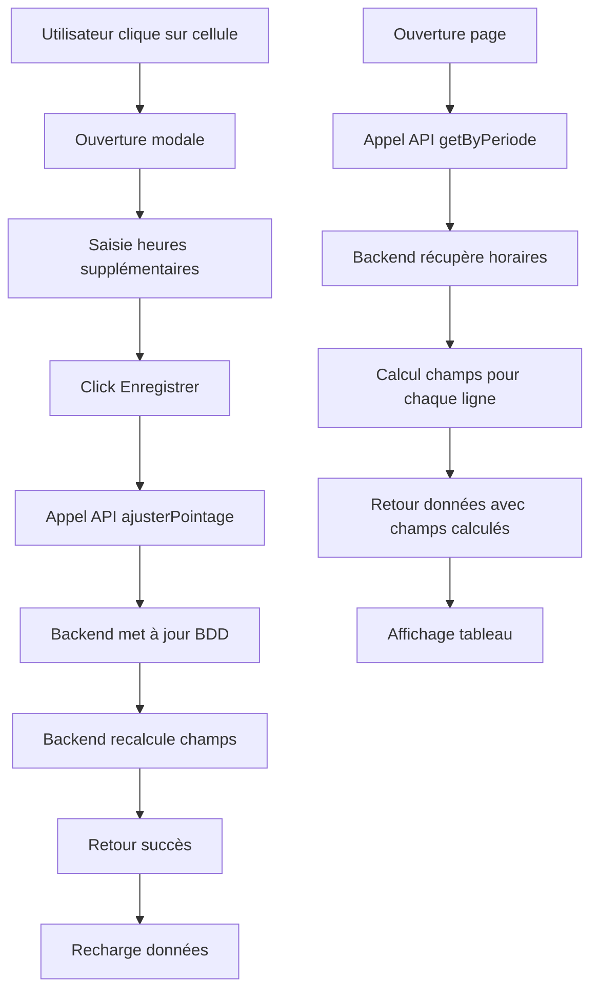

# Plan détaillé: Modification du pointage avec heures supplémentaires

## Contexte

Le système actuel de pointage nécessite des améliorations pour :
1. Calculer automatiquement les champs `retard`, `departAnticipe`, `presenceReelle` dans l'endpoint `GET /api/pointage/periode`
2. Ajouter le calcul des heures supplémentaires (`heuresSupp`)
3. Permettre la saisie des heures supplémentaires dans la modale de gestion du pointage

---

## État actuel

### Backend
- **Fichier**: `backend/src/controllers/pointage.controller.js`
- **`getPointageByPeriode`** (lignes 161-194): Retourne les données brutes du pointage SANS les champs calculés
- **`calculerChampsPointage`** (lignes 57-80): Fonction EXISTS mais NON utilisée dans `getPointageByPeriode`
- **`ajusterPointage`** (lignes 724+): Utilise déjà `calculerChampsPointage` en interne

### Base de données (table `horaires`)
Champs disponibles :
- `Date`, `Jour_semaine`, `Heure_debut`, `Heure_fin`
- `Pause_debut`, `Pause_fin`
- `Est_ouvert`, `Est_jour_ferie`, `Type_chome`

### Frontend
- **Fichier**: `frontend/src/pages/personnel/Pointage.tsx`
- **Modale** (lignes 649-803): Champs actuels = Statut, Heure arrivée, Heure départ, Commentaire
- **Type** `PointageRow` (`frontend/src/types/pointage.types.ts`): Contient déjà `Retard`, `Depart_anticipe`, `Presence_reelle`, `H_sup`

---

## Étape 1: Backend - Modifier `getPointageByPeriode`

### Objectif
Ajouter les champs calculés à chaque enregistrement de pointage

### Modifications dans `backend/src/controllers/pointage.controller.js`

#### 1.1 Créer une fonction étendue `calculerChampsPointageEtendu`
```javascript
const calculerChampsPointageEtendu = ({ entree, sortie, horaire }) => {
  // horaire contient: Heure_debut, Heure_fin, Pause_debut, Pause_fin, Est_ouvert, Est_jour_ferie, Type_chome
  
  let retard = null;
  let departAnticipe = null;
  let presenceReelle = '00:00:00';
  let heuresSupp = 0;
  
  // Vérifier si jour chômé, férié ou fermé
  if (horaire) {
    const estJourFerie = horaire.Est_jour_ferie === 1;
    const estFerme = horaire.Est_ouvert === 0;
    const estChome = horaire.Type_chome && horaire.Type_chome !== 'non_chomé';
    
    if (estJourFerie || estFerme || estChome) {
      return { retard: null, departAnticipe: null, presenceReelle: '00:00:00', heuresSupp: 0 };
    }
  }
  
  const entreeSec = parseTimeToSeconds(entree);
  const sortieSec = parseTimeToSeconds(sortie);
  const debutSec = parseTimeToSeconds(horaire?.Heure_debut || '08:00:00');
  const finSec = parseTimeToSeconds(horaire?.Heure_fin || '17:00:00');
  const pauseDebutSec = parseTimeToSeconds(horaire?.Pause_debut);
  const pauseFinSec = parseTimeToSeconds(horaire?.Pause_fin);
  
  // Calcul du retard
  if (entreeSec !== null && debutSec !== null && entreeSec > debutSec) {
    retard = secondsToTime(entreeSec - debutSec);
  }
  
  // Calcul du départ anticipé
  if (sortieSec !== null && finSec !== null && sortieSec < finSec) {
    departAnticipe = secondsToTime(finSec - sortieSec);
  }
  
  // Calcul de la présence réelle
  if (entreeSec !== null && sortieSec !== null && sortieSec >= entreeSec) {
    let pauseDuree = 0;
    if (pauseDebutSec !== null && pauseFinSec !== null && pauseFinSec > pauseDebutSec) {
      pauseDuree = pauseFinSec - pauseDebutSec;
    }
    presenceReelle = secondsToTime(sortieSec - entreeSec - pauseDuree);
  }
  
  // Calcul des heures supplémentaires
  if (sortieSec !== null && finSec !== null && pauseFinSec !== null) {
    const finPauseSec = pauseFinSec || finSec;
    if (sortieSec > finPauseSec) {
      // Heures au-delà de la fin de pause
      heuresSupp = (sortieSec - finPauseSec) / 3600; // en heures
    }
  }
  
  return { retard, departAnticipe, presenceReelle, heuresSupp };
};
```

#### 1.2 Modifier `getPointageByPeriode` (lignes 161-194)

```javascript
exports.getPointageByPeriode = async (req, res) => {
  try {
    const { debut, fin, personnelId } = req.query;
    
    let query = `
      SELECT p.*, pers.Nom_prenom, pers.Matricule
      FROM pointage p
      LEFT JOIN personnel pers ON p.ID_Personnel = pers.ID
      WHERE p.Date BETWEEN ? AND ?
    `;
    const params = [debut, fin];
    
    if (personnelId) {
      query += ` AND p.ID_Personnel = ?`;
      params.push(personnelId);
    }
    
    query += ` ORDER BY p.Date, p.ID_Personnel`;
    
    const [rows] = await db.query(query, params);
    
    // Récupérer tous les horaires de la période
    const [horaires] = await db.query(
      'SELECT * FROM horaires WHERE Date BETWEEN ? AND ?',
      [debut, fin]
    );
    
    // Créer une map pour un accès rapide aux horaires par date
    const horairesMap = new Map();
    horaires.forEach(h => horairesMap.set(h.Date, h));
    
    // Ajouter les champs calculés à chaque enregistrement
    const rowsWithCalculatedFields = rows.map(row => {
      const horaire = horairesMap.get(row.Date);
      const { retard, departAnticipe, presenceReelle, heuresSupp } = calculerChampsPointageEtendu({
        entree: row.Entree,
        sortie: row.Sortie,
        horaire: horaire
      });
      
      return {
        ...row,
        Retard: retard,
        Depart_anticipe: departAnticipe,
        Presence_reelle: presenceReelle,
        H_sup: heuresSupp
      };
    });
    
    res.json({
      success: true,
      count: rowsWithCalculatedFields.length,
      data: rowsWithCalculatedFields
    });
  } catch (error) {
    console.error('Erreur getPointageByPeriode:', error);
    res.status(500).json({ 
      success: false, 
      error: 'Erreur lors de la récupération du pointage' 
    });
  }
};
```

---

## Étape 2: Backend - Mettre à jour `ajusterPointage`

### Objectif
Permettre la saisie manuelle des heures supplémentaires

### Modifications dans `backend/src/controllers/pointage.controller.js`

#### 2.1 Modifier la requête UPDATE dans `ajusterPointage` (autour de la ligne 820+)

Ajouter `H_sup` dans les champs mis à jour :

```javascript
await db.query(
  `UPDATE pointage SET
    Matricule = ?,
    Nom = ?,
    Debut = ?,
    Fin = ?,
    Entree = NULL,
    Sortie = NULL,
    Retard = NULL,
    Depart_anticipe = NULL,
    Presence_reelle = NULL,
    H_sup = NULL,
    Absent = 1,
    Commentaire = ?,
    Date_modification = NOW()
  WHERE ID_Personnel = ? AND Date = ?`,
  [matricule, nom, null, null, Commentaire, personnelId, targetDate]
);
```

Pour le cas `present` :

```javascript
await db.query(
  `UPDATE pointage SET
    Matricule = ?,
    Nom = ?,
    Debut = ?,
    Fin = ?,
    Entree = ?,
    Sortie = ?,
    Retard = ?,
    Depart_anticipe = ?,
    Presence_reelle = ?,
    H_sup = ?,
    Absent = 0,
    Commentaire = ?,
    Date_modification = NOW()
  WHERE ID_Personnel = ? AND Date = ?`,
  [matricule, nom, entreeNorm, sortieNorm, retard, departAnticipe, presenceReelle, H_sup, Commentaire, personnelId, targetDate]
);
```

#### 2.2 Modifier la requête INSERT dans `ajusterPointage`

Ajouter `H_sup` dans les champs insérés.

---

## Étape 3: Frontend - Mettre à jour le type

### Fichier: `frontend/src/types/pointage.types.ts`

Le type `PointageRow` contient déjà `H_sup?: number | null;`. Vérifier que c'est bien utilisé.

Mettre à jour `PointageAjustementPayload` pour inclure les heures supplémentaires :

```typescript
export interface PointageAjustementPayload extends PointagePayloadBase {
  Nom?: string;
  Statut: 'present' | 'absent';
  Entree?: string | null;
  Sortie?: string | null;
  H_sup?: number | null;  // Ajouter ce champ
  Commentaire?: string;
}
```

---

## Étape 4: Frontend - Modifier la modale de gestion du pointage

### Fichier: `frontend/src/pages/personnel/Pointage.tsx`

#### 4.1 Ajouter un state pour les heures supplémentaires

```typescript
const [modalHeuresSupp, setModalHeuresSupp] = useState<number | undefined>();
```

#### 4.2 Initialiser le state dans `openCellModal`

```typescript
const openCellModal = (personnel: Personnel, date: string) => {
  const pointage = pointageMap.get(getCellKey(personnel.ID, date));
  setCommentaire(pointage?.Commentaire || '');
  setModalStatut(pointage?.Absent === 1 ? 'absent' : 'present');
  setModalEntree(pointage?.Entree ? pointage.Entree.slice(0, 5) : '');
  setModalSortie(pointage?.Sortie ? pointage.Sortie.slice(0, 5) : '');
  setModalHeuresSupp(pointage?.H_sup ?? undefined);  // Ajouter cette ligne
  setModal({ personnel, date, pointage });
};
```

#### 4.3 Réinitialiser dans `closeModal`

```typescript
const closeModal = () => {
  setModal(null);
  setCommentaire('');
  setModalStatut('present');
  setModalEntree('');
  setModalSortie('');
  setModalHeuresSupp(undefined);
};
```

#### 4.4 Ajouter le champ dans la modale (section "Mise a jour manuelle")

```tsx
<div>
  <label className="block text-xs text-gray-600 mb-1">Heures supplémentaires</label>
  <input
    type="number"
    step="0.5"
    min="0"
    value={modalHeuresSupp ?? ''}
    onChange={(e) => setModalHeuresSupp((e.target as HTMLInputElement).value ? Number((e.target as HTMLInputElement).value) : undefined)}
    disabled={modalStatut === 'absent'}
    className="w-full px-3 py-2 border border-gray-300 rounded-lg text-sm disabled:bg-gray-100 disabled:text-gray-500"
    placeholder="0"
  />
</div>
```

#### 4.5 Mettre à jour `handleAjusterPointage` pour envoyer les heures supplémentaires

```typescript
const handleAjusterPointage = async () => {
  if (!modal) return;
  try {
    setSavingAction(true);
    await pointageApi.ajusterPointage({
      ID_Personnel: modal.personnel.ID,
      Matricule: modal.personnel.Matricule,
      Nom: modal.personnel.Nom_prenom,
      Date: modal.date,
      Statut: modalStatut,
      Entree: modalStatut === 'present' ? (modalEntree || null) : null,
      Sortie: modalStatut === 'present' ? (modalSortie || null) : null,
      H_sup: modalStatut === 'present' ? (modalHeuresSupp ?? null) : null,  // Ajouter cette ligne
      Commentaire: commentaire || undefined,
    });
    showToast.success('Pointage mis a jour');
    await loadData();
    closeModal();
  } catch (err: any) {
    showToast.error(err?.error || err?.message || 'Erreur mise a jour pointage');
  } finally {
    setSavingAction(false);
  }
};
```

---

## Étape 5: Frontend - Mettre à jour l'API

### Fichier: `frontend/src/api/pointage.ts`

Vérifier que `ajusterPointage` envoie bien le champ `H_sup`. Si ce n'est pas le cas, ajouter ce champ au payload.

---

## Résumé des fichiers à modifier

| Fichier | Modifications |
|---------|---------------|
| `backend/src/controllers/pointage.controller.js` | 1. Ajouter `calculerChampsPointageEtendu`<br>2. Modifier `getPointageByPeriode`<br>3. Modifier `ajusterPointage` pour accepter `H_sup` |
| `frontend/src/types/pointage.types.ts` | Ajouter `H_sup` à `PointageAjustementPayload` |
| `frontend/src/pages/personnel/Pointage.tsx` | 1. Ajouter state `modalHeuresSupp`<br>2. Ajouter champ dans la modale<br>3. Mettre à jour `handleAjusterPointage` |
| `frontend/src/api/pointage.ts` | Vérifier le payload de `ajusterPointage` |

---

## Diagramme de flux


